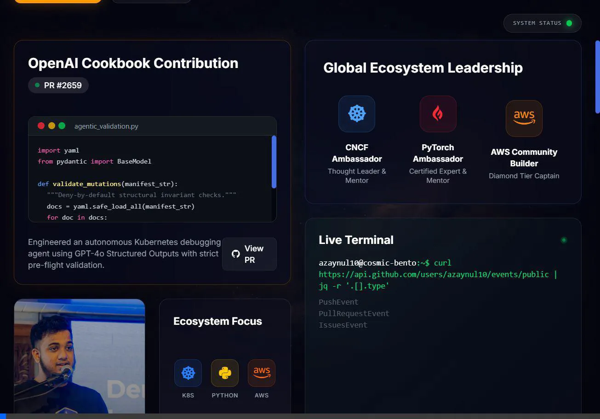

# Zaynul Abedin Miah | Personal Portfolio



A high-performance, responsive, and cinematic personal portfolio built to showcase cloud-native engineering and AI development projects.

## 🚀 Architecture & Tech Stack

This portfolio is built for speed and aesthetics, utilizing a modern web stack:

*   **Framework:** React 19 + Vite
*   **Styling:** Tailwind CSS v4
*   **Icons:** FontAwesome 6 & Lucide-React
*   **Hosting:** Vercel (CI/CD Pipeline)

## 🌌 "Cosmic Bento" Aesthetic Features

*   **Vibe Coding Aesthetics:** Deep `#050510` space-black backgrounds with glassmorphic cards (frosted glass, semi-transparent backgrounds).
*   **Multi-Layer Parallax Starfield:** Hardware-accelerated `<canvas>` background featuring 3 layers of drifting, twinkling stars.
*   **Nebula Shift Gradients:** Slow-breathing, deep-color background nebulas synced to the site's rhythm.
*   **Pulsing Sync:** Interactive card borders and a "System Status" indicator pulse in harmony with the background shifts.
*   **Cinematic Digital Noise:** A low-opacity fractal noise SVG overlay mimics a high-end engineering terminal.

## 🛠️ Local Development

To run this project locally on your machine:

1.  **Clone the repository**
2.  **Install dependencies:**
    ```bash
    npm install
    ```
3.  **Start the development server:**
    ```bash
    npm run dev
    ```

## 🤝 Contact

Feel free to reach out for collaborations:
- Email: [zaynulabedinmiah10@gmail.com](mailto:zaynulabedinmiah10@gmail.com)
- LinkedIn: [zaynul-abedin-miah](https://www.linkedin.com/in/zaynul-abedin-miah/)
- GitHub: [@azaynul10](https://github.com/azaynul10)
